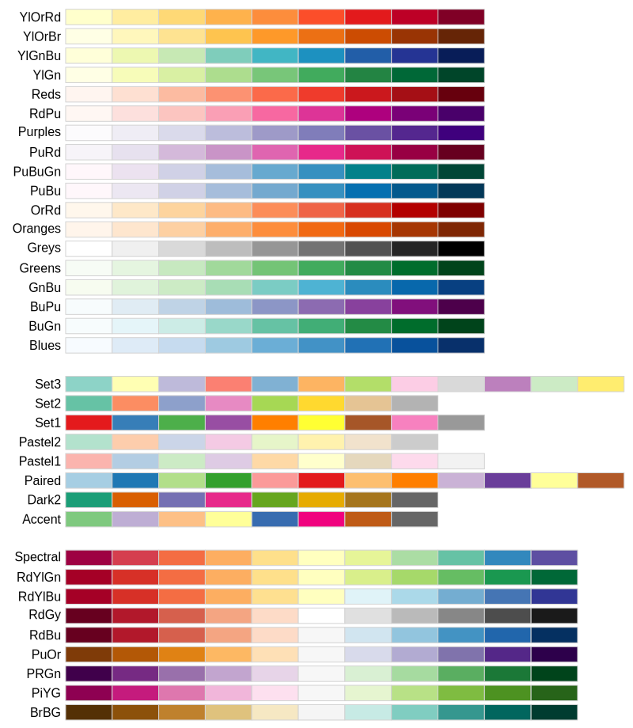

# kongdd_packages

>  Dongdong Kong, Sun Yat-sen University

## Table of Content
[TOC]

## Installation

This repository is a GEE package in `JavaScript`. You can access it by 
https://code.earthengine.google.com/?accept_repo=users/kongdd/public.

## Functions

### 1. Visualization

Require this package first:

```javascript
var pkg_vis  = require('users/kongdd/public:pkg_vis.js');
```

#### Palette

Show available palettes provided by `pkg_vis`. This function is modified from [Gena](https://github.com/gena)‘s package.

```javascript
pkg_vis.showColors()
```

   
*<u>Figure 1. Available palettes.</u>*

#### Legend

1. gradient legend

   ```javascript
   useage: pkg_smooth.grad_legend(viz, title, IsPlot, position)
   
   - viz           Visualization parameters.
   - title         String, legend title.
   - IsPlot        Whether to plot in the current Map? Setting false when you need to
                   combine legends or put legend to other subplot Map.  
   - position      String, legend position, e.g. "bottom-left", "bottom-right".
   ```

2. discrete legend

   ```javascript
   useage: pkg_smooth.discrete_legend(names, palette, title, IsPlot, position)
   
   - names         The name of every item.
   - palette       Corresponding colors.
   - title         String, legend title.
   - IsPlot        Whether to plot in the current Map? Setting false when you need to
                   combine legends or put legend to other subplot Map.  
   - position      String, legend position, e.g. "bottom-left", "bottom-right".
   ```

You can access this example of gradient and discrete legend by the link 
https://code.earthengine.google.com/c35e156e943370c1dd363732a5b59531.

#### Layout

`layout` function here is just like `layout` in **R** and `subplot` in __MATLAB__ , which is used to produce multiple maps.


### 2. Temporal interpolation

Require this package first:

```javascript
var pkg_smooth = require('users/kongdd/public:Math/pkg_smooth.js');
```

#### Linear interpolation

```
usage: pkg_smooth.linearInterp(imgcol, frame, nodata)

- imgcol        The ImageCollection to be interpolated. 
- frame         The window size (unit: day) to seach the nearenearest valid good values
                before and after the current point. Then used the nearest valid good
                values to linterpolate missing value.
- nodata        The value of `NODATA`. The default is 0. Caution about band's data 
                type.
```

You can access this example by this link https://code.earthengine.google.com/3b08f56a5f646104c742be584877e94e.

#### Historical average interpolation

```
usage: pkg_smooth.historyInterp(imgcol, imgcol_his_mean, prop, nodata)

- imgcol          The ImageCollection to be interpolated. 
- imgcol_his_mean The ImageCollection of historical average value.
- prop          metadata property. imgcol and imgcol_his_mean are joined according to
				this property (e.g. month, dayOfYear).
- nodata        The value of `NODATA`. The default is 0. Caution about band's data
                type.
```

You can access this example by this link https://code.earthengine.google.com/3b08f56a5f646104c742be584877e94e.

`wBisquare_array` Bisquare weights updating function

### 3. Trend Analysis

Require this package:

```
var pkg_trend = require('users/kongdd/public:Math/pkg_trend.js');
```

#### aggregate_prop

```javascript
// add the property of Year, YearStr, YearMonth, Season
imgcol      = pkg_trend.imgcol_addSeasonProb(imgcol); 
imgcol_year = pkg_trend.aggregate_prop(imgcol, "year", 'mean');
```

`aggregate_prop` is just like `aggregate` function in  **R** . 

```
usage: pkg_trend.aggregate_prop(ImgCol, prop, reducer, delta)

- ImgCol           ImageCollection
- prop             String. Note that prop can't be number. 
				   ImgCol will be aggregated by prop (metadata property). 
				   Hence, ImgCol must have this property. For examples, 
				   if you want to aggregate by month, you need to add month
				   property first.
- reducer          ee.Reducer (e.g. 'sum', 'mean'). ImgCol aggregated by 
				   reducer.
- delta            If true, reducer will be ignore, and return 
				   deltaY = y_end - y_begin (for dataset like GRACE).
```


#### linearTrend

```
usage: pkg_trend.linearTrend(ImgCol, robust)

- ImgCol           The ImageCollection to calculate trend.
- robust           If true, robust linear regression will be used; if 
                   false, traditional linear regression will be used.
```


### 4. Export data

Require this package:

```
var pkg_trend = require('users/kongdd/public:Math/pkg_trend.js');
```

*<u>If you need to download in batch, suggest combining with [gee_monkey](https://github.com/kongdd/gee_monkey).</u>*   

#### ExportImg

Export `ee.Image` in degree:

```
useage: pkg_export.ExportImg(Image, task, range, cellsize, type, folder, crs, crsTransform)

- Image             The image to export.
- task              The file name of exported image.
- range             [lon_min, lat_min, lon_max, lat_max].
- cellsize          cellsize (in the unit of degree), used to calculate dimension.
- type              Export type, i.e. 'asset', 'cloud' and 'drive'
- folder            The Folder that the export will reside in. If export type is cloud 
                    or asset, folder need to be absolute path.
- crs               CRS to use for the exported image.
- crsTransform      Affine transform to use for the exported image. Requires "crs" to 
					be defined.
```

#### ExportImgCol

Export `ee.ImageCollection` in degree:

```
useage: pkg_export.ExportImgCol(ImgCol, dateList, range, cellsize, type, folder, crs, crsTransform, prefix)

- ImgCol    
- dateList
...
Other parameters same as `pkg_export.ExportImg`
```

Export examples here https://code.earthengine.google.com/9abf7b0190f2e45b4d1f75d9a6b5f5f5.
